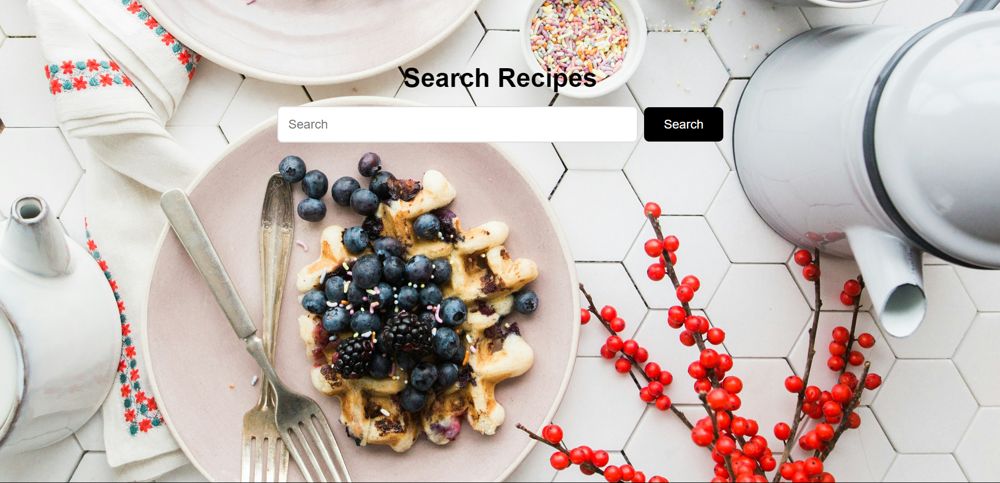
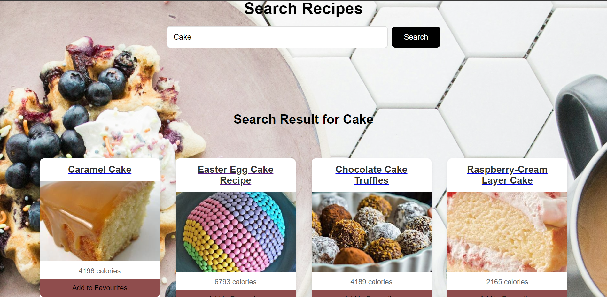
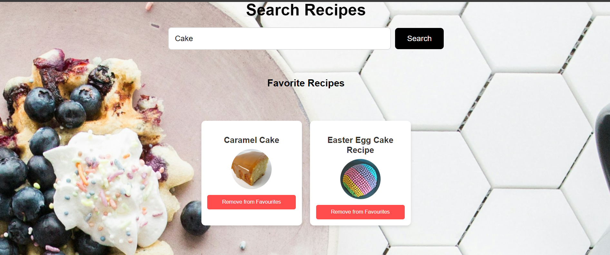
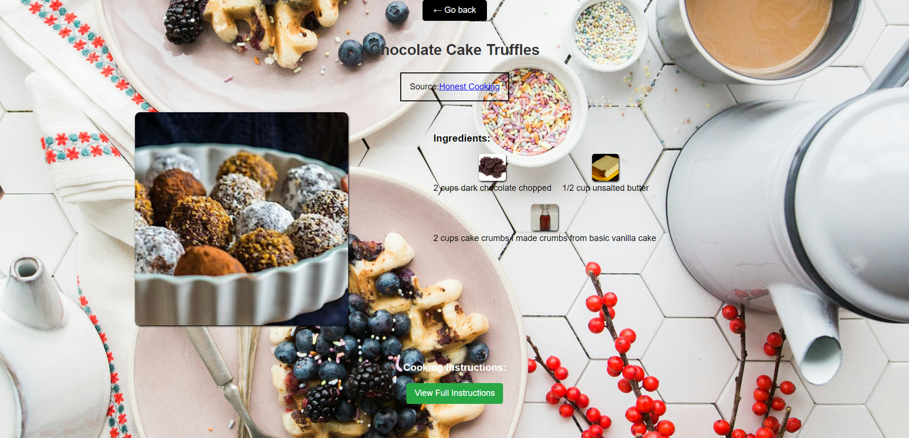

# Recipe Search Application

This is a recipe search application where users can search for recipes based on ingredients or keywords. The app fetches recipe data from the Edamam API and allows users to add their favorite recipes, which are stored in local storage for persistence.

## Features

- **Search Recipes**: Users can search for recipes based on a keyword or ingredient.
- **View Search Results**: Displays the list of recipes with an image, title, and calorie information.
- **Add to Favorites**: Users can add a recipe to their favorites list, and it will be saved in the browser's local storage.
- **Remove from Favorites**: Users can remove recipes from the favorites list, and the changes will be reflected in both the UI and local storage.
- **Persistent Favorites**: The app remembers the user's favorite recipes even after the browser is closed or refreshed (using local storage).

## Technologies Used

- **React**: A JavaScript library for building user interfaces.
- **Edamam API**: Provides the recipe data based on the search queries.
- **Local Storage**: Stores the user's favorite recipes in their browser so the favorites persist across page reloads.
# ScreenShots
# HOME

# SEARCH

# FAVORITES

# Item

